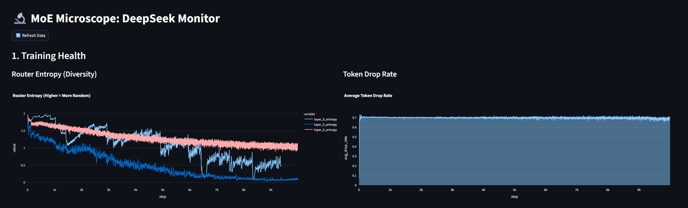
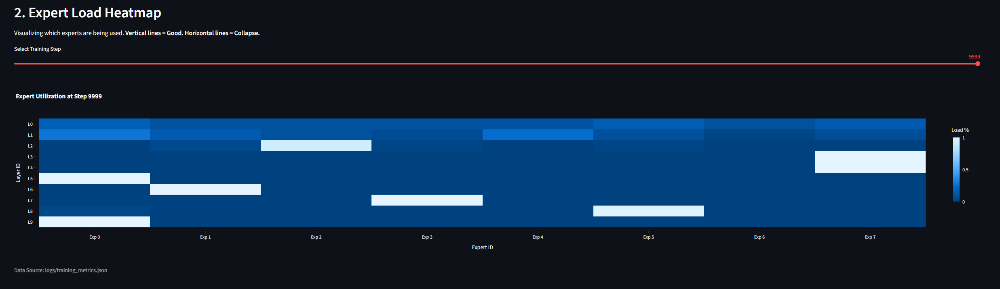

# 🔍 MoE-Microscope: Post-Training Analysis

**Experiment:** DeepSeek-V3 Architecture on TinyShakespeare
**Duration:** 10,000 Steps
**Outcome:** Convergence (Loss 4.06), but detected **Layer-Specific Router Collapse**.

---

## 1. The "Invisible" Success (Standard Metrics)
If we rely solely on standard training metrics, the run appears flawless. The loss curve shows smooth, rapid convergence, suggesting the model is learning the dataset effectively.

*   **Initial Loss:** 27.60
*   **Final Loss:** ~4.06
*   **Perplexity:** Low (Model generates coherent English text).

**Conclusion from Standard Metrics:** *The model is perfect.*

---

## 2. The "Visible" Failure (Dashboard Diagnostics)
Using the **MoE-Microscope**, we observed a critical anomaly that standard metrics missed. While the model *is* learning, it is **not** utilizing the Mixture-of-Experts architecture as intended in the deeper layers.

### Evidence A: The Entropy Drop
As seen in the chart below, the Router Entropy (a measure of how randomly/evenly the router picks experts) steadily decreases. While a decrease is expected as the model learns, the deep drop to nearly **0.0** in later layers suggests the router became deterministic—picking only one expert.



### Evidence B: The Heatmap Progression (The Smoking Gun)
We observed the **"Rich Get Richer"** phenomenon occurring in real-time. The heatmap below shows the state at Step 9999.



#### Phase A: Healthy Initialization (Layers 0-1)
*   **Observation:** The first two layers (L0, L1) remained healthy throughout training.
*   **Visual:** Blue color is distributed across multiple experts.
*   **Meaning:** Input tokens are diverse enough that the router effectively distributes them to different experts.

#### Phase B: The Collapse (Layers 2-9)
*   **Observation:** Starting around Step 2000, Layers 2 through 9 collapsed into a single expert per layer.
*   **Visual:** Single horizontal white lines (High Load) with dark blue everywhere else (Zero Load).
    *   *Layer 2* $\rightarrow$ Collapsed to Expert 2.
    *   *Layer 4* $\rightarrow$ Collapsed to Expert 7.
*   **Meaning:** The router decided that a single expert was sufficient to handle the internal hidden states. The model effectively pruned itself into a **Dense Transformer** with 1/8th the available parameters.

---

## 3. Root Cause Analysis

### Why did the Loss improve if the MoE collapsed?
The Shakespeare dataset is relatively simple. The model realized it didn't *need* the capacity of 8 experts to solve the task. It found a local minimum where routing everything to one expert was easier than learning to route dynamically.

### Why didn't the "Loss-Less Balancing" fix it?
We implemented DeepSeek's **Expert Bias Adjustment** mechanism:
```python
if load > target_load:
    self.expert_bias -= bias_update_rate  # Penalize the greedy expert
```
**Failure Point:** The `bias_update_rate` (set to `0.001`) was **too weak**.
1.  A specific expert got lucky with initialization.
2.  The router increased its confidence (logits) in that expert faster than the bias could penalize it.
3.  The greedy expert received all the gradient updates, becoming smarter, while other experts starved.
4.  By step 2000, the "rich" expert was so smart that the router preferred it *despite* the bias penalty.

---

## 4. Conclusion & Next Steps
This experiment validates the core premise of the **MoE-Microscope**: **Router collapse is invisible to the loss curve.** Without this dashboard, we would have deployed a model that was wasting 87.5% of its compute capacity in deep layers.

**Recommendations for Run #2:**
1.  **Increase Bias Rate:** Boost `bias_update_rate` from `0.001` to `0.05` to aggressively penalize collapse early.
2.  **Jitter Noise:** Inject Gaussian noise into the router logits during training (Standard practice in Google/DeepMind MoEs) to force exploration.
